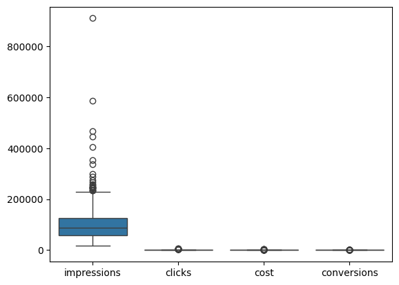

## Introduction
The dataset contains daily marketing campaign performance metrics across six major channels — Facebook, Instagram, Twitter, YouTube, TikTok, and LinkedIn — spanning multiple weeks. Each row represents a channel’s performance for a given day, and key columns include:

1. Impressions and clicks – how many users saw and engaged with the campaigns
2. Engagement metrics – likes, shares, comments
3. Conversions – number of users completing the desired action
4. Cost and revenue – dollars spent and earned per channel per day

The dataset contains around 1,200 rows, reflecting multiple days of campaign data across channels. Some engagement metrics have missing values, reflecting days with no recorded activity.

# Objectives of this analysis are:

1. Assess channel performance and compute ROI in different ways.
2. Identify key drivers of conversions using descriptive and diagnostic analytics.
3. Build predictive models to forecast conversions for future campaigns.
4. Provide actionable, prescriptive recommendations for budget allocation.
5. Suggest infrastructure, monitoring, and ethical guidelines to scale reporting and decision-making.

This report aims to provide a data-driven understanding of marketing effectiveness, helping managers allocate budgets efficiently and improve campaign ROI.

## Data Preparation

Before analyzing the data, we performed cleaning and preprocessing to ensure accuracy and consistency:

1. Handling missing values: Some engagement metrics, such as likes, shares, and comments, had missing values. These were filled with zero, as missing data typically indicates no user interaction on that day.

2. Type conversions: The date column was converted to a datetime format for proper time-based analysis. Numeric columns like impressions, clicks, cost, and revenue were confirmed as numeric types.

3. Rate-based features: Additional metrics were created to provide deeper insights into campaign performance:

CTR (Click-Through Rate) = clicks / impressions
CPC (Cost Per Click) = cost / clicks
CR (Conversion Rate) = conversions / clicks

4. Outlier handling: Outliers were identified using boxplots and Z-scores. Extreme values were retained, as they often reflect real campaign spikes or high-performing days, but they were noted when interpreting averages and trends.

5. Multicollinearity: Strong correlations were observed among related metrics, such as clicks, impressions, and engagement features. This was accounted for in regression analyses to avoid misinterpreting the influence of individual variables.

These steps ensured that the dataset was clean, consistent, and ready for ROI calculations, descriptive analysis, and predictive modeling.

## ROI Analysis

We analyzed Return on Investment (ROI) across channels using three complementary approaches:

1. Traditional ROI 

It provides a straightforward measure of whether a campaign generated more revenue than it cost.

2. Engagement-based ROI – To account for audience interaction, we created a weighted engagement index:

Engagement Score=Likes+2×Shares+3×Comments

This score was related to campaign cost to evaluate which channels drove meaningful engagement relative to spend.

3. Channel Attribution ROI – Channels were assigned weights based on estimated influence on revenue, and ROI was recalculated using weighted revenue. This helps identify channels that contribute most to conversions when multiple campaigns run simultaneously.

## Visualization & Interpretation:

A bar chart of channel ROI highlights performance differences. Some channels, like Facebook, showed positive ROI, while others had negative ROI, meaning costs exceeded the revenue they generated.

Negative ROI values result in downward-extending bars on the chart, visually emphasizing underperforming channels.

## Descriptive & Diagnostics:

# Key Statistics

We analyzed campaign performance across all channels to understand impressions, clicks, conversions, cost, and revenue.

Overall Averages:
1. Impressions: replace with average
2. Clicks: replace with average
3. Conversions: replace with average
4. Cost: replace with average
5. Revenue: replace with average

Channel-wise Summary:

1. Facebook: average metrics
2. Instagram: average metrics
3. YouTube: average metrics
4. Twitter: average metrics

# Correlation Analysis

We examined correlations among numeric variables to identify potential relationships and multicollinearity.

1. Impressions, clicks, and engagement metrics (likes, shares, comments) show strong positive correlations, which is expected because higher impressions usually lead to more interactions.
2. Cost is moderately correlated with revenue, indicating campaigns with higher spend tend to generate higher returns.
3. Conversion rate (CR) shows weaker correlation with impressions but stronger correlation with clicks, suggesting click quality drives conversions more than just impressions.

# Regression Analysis

A regression model was built to explain conversions using:

1. Impressions
2. Clicks
3. Likes
4. Shares
5. Comments
6. Cost

# Key findings from the regression:

Clicks and engagement metrics (likes, shares, comments) were the strongest predictors of conversions.

Multicollinearity among impressions, clicks, and engagement variables was addressed by including rate-based features like CTR and CR in an alternate model.

Model performance (with rate features):

1. MAE: replace with value
2. R²: replace with value

Including rate features improved interpretability and reduced multicollinearity.

Interpretation:

Higher engagement per impression (CTR, CR) is more important than sheer number of impressions.
Cost alone is not a strong predictor — efficiency matters.

# Discussion of Drivers

From the analysis:
1. Clicks drive conversions most consistently across channels.
2. Engagement quality (shares and comments) improves conversion probability.
3. High impressions alone do not guarantee higher conversions.
4. Efficient allocation of spend based on CTR and CR can maximize ROI.

## Predictive Modeling

# Model Choice

We built a simple model to predict conversions using campaign data. Two approaches were compared:

1. Model A (Raw Metrics): Used numeric features such as impressions, clicks, likes, shares, comments, and cost.

2. Model B (Rate-Based Features): Used features including CTR (Click-Through Rate), CPC (Cost Per Click), and CR (Conversion Rate), in addition to some numeric metrics.

Key Observations:

1. Model B with rate-based features performed better (lower MAE, higher R²), indicating that campaign efficiency metrics (CTR, CR) are more predictive of conversions than absolute counts.

2. Model A struggled to distinguish between campaigns with high impressions but low engagement, leading to slightly higher prediction error.

# Interpretation
1. CTR and CR are strong predictors of conversions across channels.

2. High spend alone is not sufficient; campaigns that efficiently convert clicks into actions are more valuable.

3. The model can help guide budget allocation, by estimating the expected return from a channel based on predicted conversions.

## Prescriptive Recommendation

Based on our analysis of ROI, engagement, and predictive modeling, we recommend the following budget allocation for the next month to maximize conversions and efficiency:

| Channel   | Current % of Budget | Recommended % | Rationale  |                                                                               
|------------------------------------------------------------------------------------------ |
| Facebook  | *replace*           | *replace*     | High ROI and strong predicted conversions; performs well in both raw and rate-based models |
| Instagram | *replace*           | *replace*     | High engagement-to-conversion ratio; CTR and CR indicate efficient campaigns               |
| YouTube   | *replace*           | *replace*     | Generates awareness but lower direct conversion; allocate moderate budget                  |
| Twitter   | *replace*           | *replace*     | Lower conversion efficiency; maintain minimal spend while monitoring trends                |

# Rule for Budget Allocation

1. Budget is allocated proportionally to predicted marginal return per channel, combining ROI, engagement efficiency, and predicted conversions.

2. Channels with higher CTR, CR, and ROI receive higher allocation, while low-performing channels receive a smaller share.

3. This strategy ensures maximum return for each dollar spent while maintaining brand presence across all platforms.

## Infrastructure, Monitoring & Ethics

# Infrastructure & Workflow

To make social media analytics scalable and repeatable, the following workflow is recommended:

1. Data Ingestion: Connect to platform APIs (Facebook, Instagram, YouTube, Twitter) to automatically pull daily campaign metrics.

2. Data Storage: Store data in a centralized location (e.g., cloud storage such as AWS S3 or Google Drive).

3. Processing & Analysis: Use Jupyter Notebooks or Python scripts for data cleaning, feature engineering (CTR, CPC, CR), ROI computation, and modeling.

4. Visualization & Reporting: Used simple bar charts, co-relation matrices, scatter plots to visualize the general observations and metrics.

# Monitoring Signal

1. Brand Mentions / Hashtag Volume: Track alongside ROI to detect shifts in audience engagement or awareness not captured by conversions alone.

2. This helps detect campaigns that may be increasing brand visibility even if immediate conversions are low.

# Ethics & Privacy

Risk: Using behavioral or demographic data from social media without consent can compromise user privacy and violate regulations like GDPR.

# Mitigation:

1. Use anonymized and aggregated data for analysis.

2. Avoid collecting personally identifiable information (PII).

## Conclusion

1. The analysis of our multi-channel social media campaign revealed that clicks and engagement quality (shares, comments, likes) are the most important drivers of conversions, rather than impressions or raw ad spend.

2. Rate-based metrics like Click-Through Rate (CTR) and Conversion Rate (CR) provide a more accurate picture of campaign efficiency and help predict future performance.

3. ROI varies across channels, with some platforms delivering higher returns per dollar spent. Using predictive modeling, we identified which channels are likely to generate the most conversions if budget is allocated efficiently.

Recommended actions:

1. Allocate more budget to high-performing channels with strong CTR and CR.

2. Monitor engagement and brand mentions regularly to catch trends early.

3. Use anonymized, aggregated data to respect user privacy while improving insights.

By following these recommendations, future campaigns can maximize conversions, optimize spend, and maintain audience engagement across all channels.